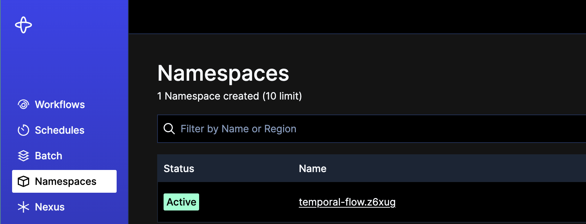
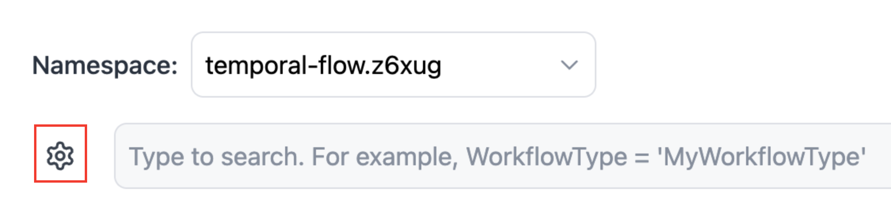
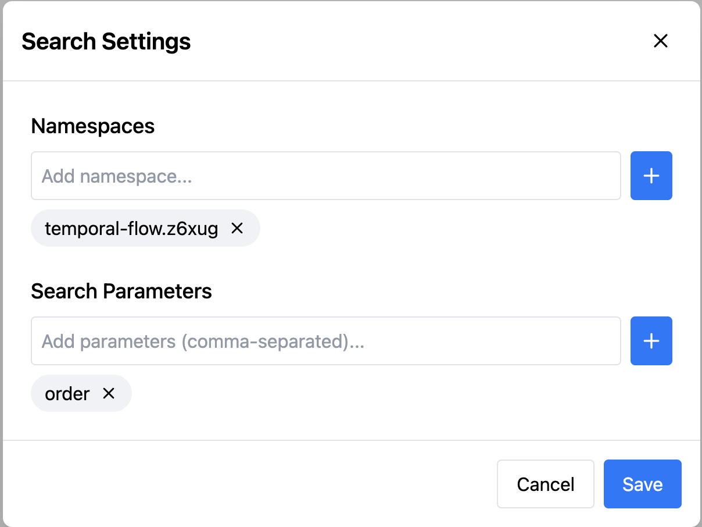
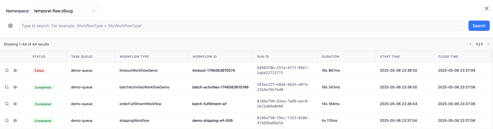
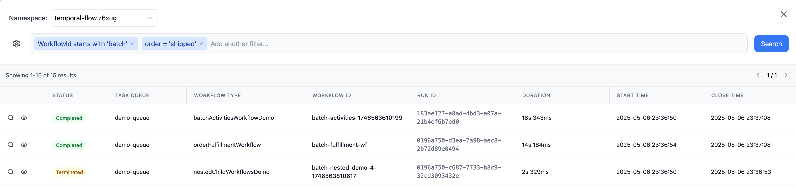
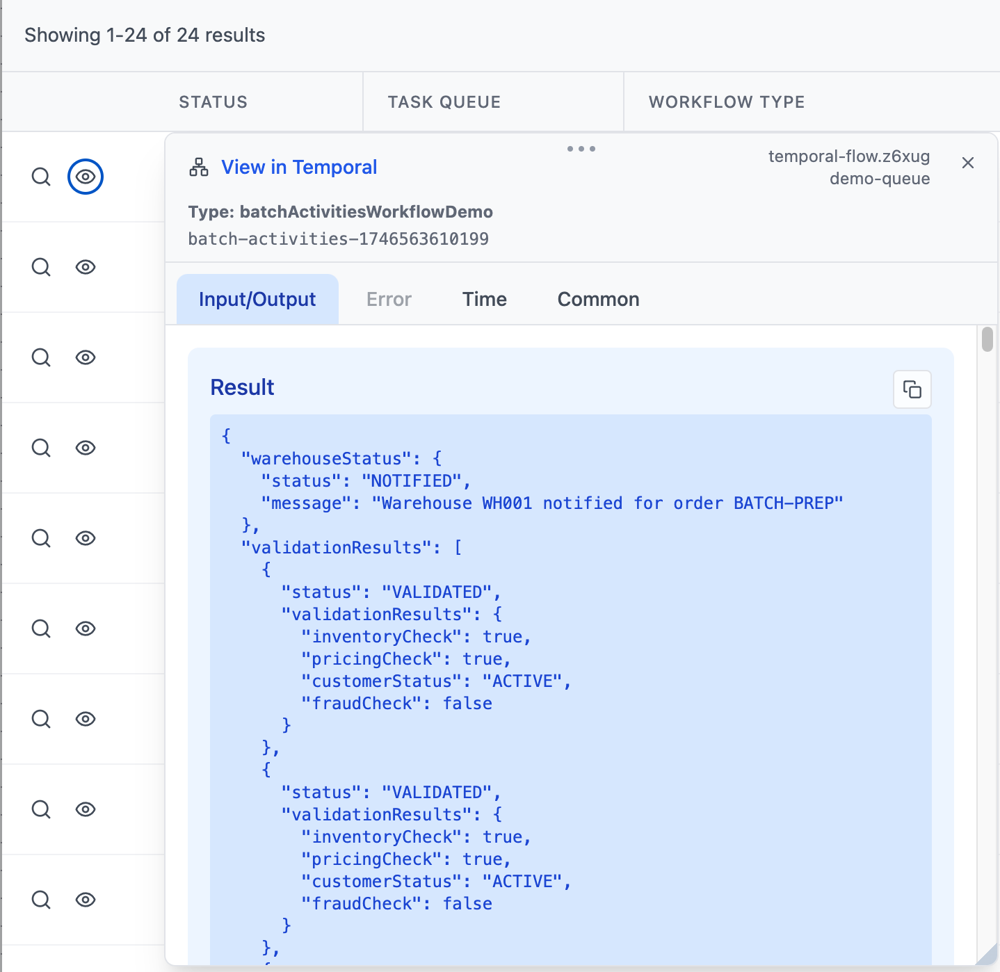
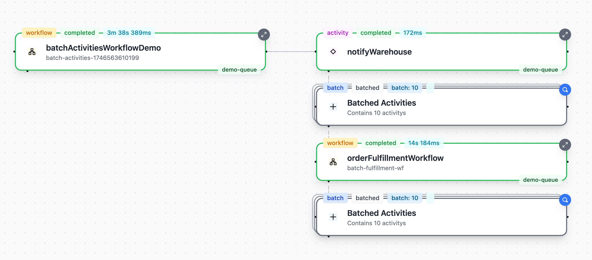
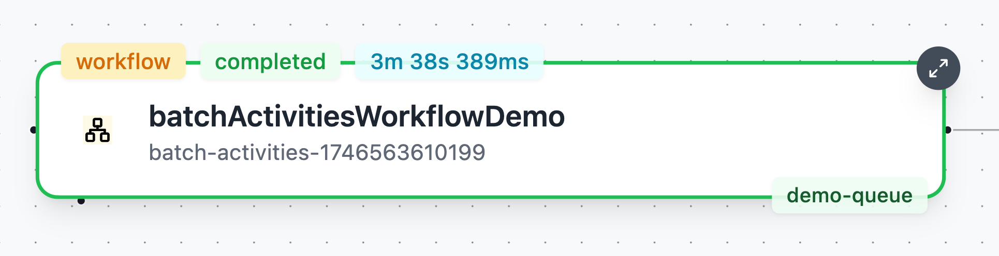
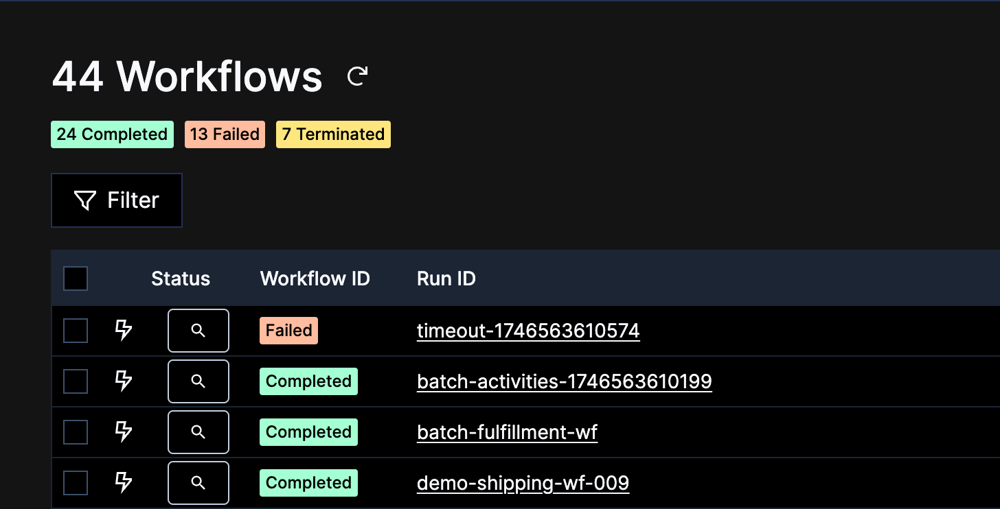

# Temporal Flow

A powerful developer tool for visualizing and debugging Temporal workflows through an interactive graph interface.

[Features](#-features) • [Demo](#-demo) • [Installation](#-installation) • [Usage](#-usage) • [Contributing](#-contributing)

## Overview

Temporal Flow is a developer tool designed to enhance observability and debugging of workflows within [Temporal](https://temporal.io/). It presents workflow executions as an interactive graph, enabling intuitive navigation through nested workflows and providing a faster, smarter search experience compared to the default Temporal Web UI.

## ✨ Features

- 🔍 **Advanced Search**  
  Quickly locate workflows, activities, and nested executions with an intuitive search bar supporting partial names, workflow types, and more.

- 🧭 **Interactive Graph Visualization**  
  Visualize relationships between parent and child workflows as an interactive node graph, making it easy to explore deeply nested or complex workflows at a glance.

- 🪄 **Seamless Exploration**  
  Hover and click on graph nodes to inspect workflow details such as execution status, timestamps, and input/output payloads—all without leaving the context of the graph.

- ⚡ **Performance Optimized**  
  Designed with performance and usability in mind to improve speed and developer experience during workflow analysis.

## 📽 Demo

[Watch the demo](https://youtu.be/jkV-PMhYk64) to see Temporal Flow in action.

## 🚀 Installation

### Prerequisites

- A running Temporal instance
- API key from your Temporal namespace

### Generate API Key

In Temporal, go to `Namespaces`, choose your namespace:

Scroll down and choose `Generate API Key`, make sure you save your API Key.

### Server Setup

1. Follow the [server setup instructions](server/README.md) to configure the backend service.
2. The server can be run either through your IDE or using the provided Docker image.

> **Note:** The server is required to fetch Temporal Events as Temporal doesn't provide a web-accessible API. This also ensures your Temporal API Key remains secure.

### Web Interface

1. Visit the [Temporal Flow Web Interface](https://itaisoudry.github.io/temporal-flow-web/)
2. Configure your namespace settings (see [Configuration](#configuration))

## 📋 Usage

### Configuration

1. Navigate to the Search page
2. Click the Settings icon
   

3. Add your Namespace and Search Parameters, then click the `+` button
   

4. Click Save

Your namespace will appear at the top, showing the default search results:

### Search Syntax

Temporal Flow supports a rich search syntax similar to Temporal's native search:

- `WorkflowId starts with 'batch'` - Find workflows with IDs starting with 'batch'
- `Status = Completed, Status = Running` - Search by multiple statuses
- Support for date-based fields (StartTime, etc.)

After completing the search query, press `Search` or hit `Enter` to execute the search.

### Search Results

Using the quick view button will show you the workflow data. You can open multiple quick views simultaneously!

Clicking the `Magnifying Glass` will load the workflow to the graph:

### Graph Navigation

- **Node Types**: Workflow, Activity, and Batch nodes
- **Node Inspection**: Click the top-right button to view detailed node data
  

- **Batch Processing**: Use the magnifying glass icon to expand batch nodes
- **Data Tabs**: Access Input/Output, Error, Time, and Common information for each node

### Chrome Extension

Enhance your workflow with our [Chrome Extension](chrome-extension/README.md) to seamlessly load workflows from Temporal into Temporal Flow.

Click the `Magnifying Glass` to open a new tab with Temporal Flow and load the chosen Workflow:

## 🤝 Feedback

Feel free to:
- Submit bug reports
- Suggest new features
- Reach out with any question, request or feedback!

## 📬 Contact

- **Email**: [temporalflowapp@gmail.com](mailto:temporalflowapp@gmail.com)
- **LinkedIn**: [Itai Soudry](https://www.linkedin.com/in/itai-soudry-257a01123)

## 📄 License

This project is licensed under the MIT License

---

Thank you for checking out this project!

